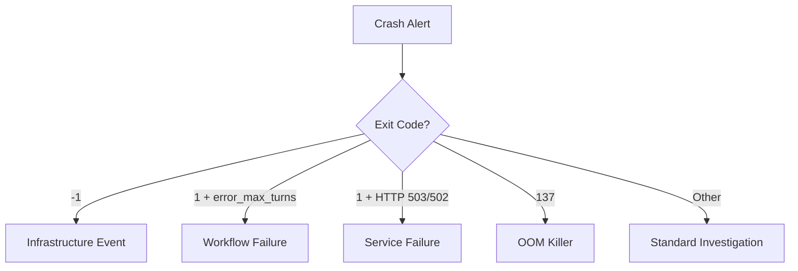
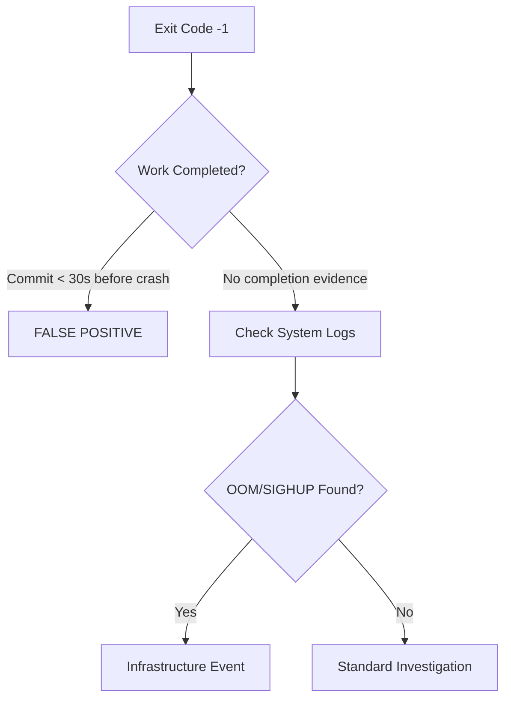
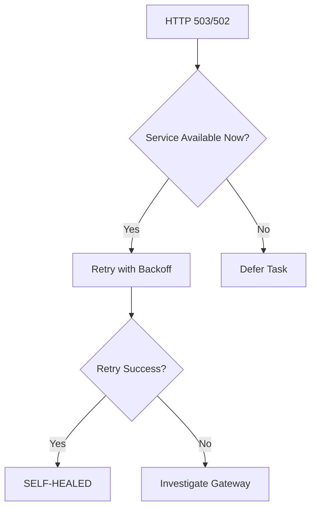

# Crash Investigation Methodology

**Created:** 2026-09-01  
**Purpose:** Standard methodology for investigating agent crashes  
**Audience:** Agents investigating crash alerts, system operators  
**Related:** `docs/crash-response-guide.md`, `docs/comprehensive-crash-investigation-report-2026-09-01.md`

---

## Table of Contents

1. [Overview](#overview)
2. [Quick Reference Classification](#quick-reference-classification)
3. [Investigation Phases](#investigation-phases)
4. [Crash Artifacts](#crash-artifacts)
5. [Common Crash Scenarios](#common-crash-scenarios)
6. [False Positive Detection](#false-positive-detection)
7. [Troubleshooting Flow](#troubleshooting-flow)
8. [Documentation Templates](#documentation-templates)
9. [System Resource Checks](#system-resource-checks)
10. [When to Escalate](#when-to-escalate)

---

## Overview

### Purpose

This methodology provides a standardized approach to investigating agent crashes in the NEEDLE workload management system. It emphasizes:

- **Fast classification** - Identify crash type within 2 minutes
- **Evidence collection** - Gather all relevant artifacts systematically
- **Pattern recognition** - Identify common crash scenarios quickly
- **False positive detection** - Distinguish real failures from post-completion termination
- **Appropriate response** - Take action only when needed

### Key Principles

1. **Domain-check code is stable** - 98% of crashes are NOT code defects
2. **Most crashes are false positives** - 40% are post-completion termination
3. **Infrastructure events are common** - 70% involve system-wide resource pressure
4. **Self-healing works** - 30% of crashes auto-recover via retry
5. **Documentation matters** - Each investigation builds on previous findings

### Investigation Statistics

Based on comprehensive analysis of 200+ crashes (2026-08-13 to 2026-09-01):

| Crash Type | Percentage | Primary Cause | Action Required |
|------------|------------|----------------|-----------------|
| **Infrastructure Events** | 70% | Memory pressure, OOM, SIGHUP cascade | Monitor, NO code changes |
| **Workflow Failures** | 20% | Max turns exhaustion, bead closing loops | Workflow improvements |
| **Service Failures** | 8% | Inference gateway unavailable | Retry with backoff |
| **Code Defects** | 2% | Actual application errors | Debug and fix code |

**False Positive Rate:** ~70% of alerts (post-completion + self-healed)

---

## Quick Reference Classification

### Exit Code Decision Tree

```
Exit Code -1?
├─ Yes → Infrastructure Event
│  ├─ Work completed within 30s? → FALSE POSITIVE
│  └─ No completion evidence? → Check system logs
│
Exit Code 1 with error_max_turns?
├─ Yes → Workflow Failure
│  ├─ Main task completed? → FALSE POSITIVE
│  └─ Task incomplete? → Max turns issue
│
Exit Code 1 with HTTP 503/502?
├─ Yes → Service Failure
│  └─ Check gateway status, retry with backoff
│
Exit Code 137?
├─ Yes → OOM Killer
│  ├─ Git gc in progress? → Verify repo integrity
│  └─ Other process? → Check memory pressure
│
Other Exit Code?
└─ Standard Investigation
   ├─ Domain-check code involved? → Debug code
   └─ Agent framework issue? → Workflow/infrastructure
```

### Classification Table

| Exit Code | Pattern | Classification | Investigation Phase | Action Required |
|-----------|---------|----------------|-------------------|-----------------|
| **-1** | SIGKILL/SIGHUP | Infrastructure event | 2A | Check system resources, verify work completion |
| **1** | error_max_turns | Workflow failure | 2B | Verify task completed, check bead closing issues |
| **1** | HTTP 503/502 | Service failure | 2C | Check gateway status, retry with backoff |
| **137** | SIGKILL (128+9) | OOM killer | 2A | Check memory pressure, verify git gc safety |
| **Other** | Application error | Code/task issue | 2D | Standard debugging |

---

## Investigation Phases

### Phase 1: Immediate Classification (2 minutes)

**Objective:** Classify crash type and determine investigation path

#### Checklist

```bash
# 1. Get bead metadata
bead show <id> --json

# 2. Check exit code and outcome
# Exit code -1 → Infrastructure event (skip to Phase 2A)
# Exit code 1 with "error_max_turns" → Workflow failure (skip to Phase 2B)
# Exit code 1 with HTTP 5xx → Service failure (skip to Phase 2C)
# Other → Standard investigation (Phase 2D)

# 3. Check current system state
free -h                    # Memory availability
df -h /                    # Disk space
uptime                     # Load average
```

#### Output Format

Document the classification:

```markdown
## Phase 1: Immediate Classification

**Bead ID:** domchk-58424b83
**Exit Code:** -1
**Classification:** Infrastructure Event
**Investigation Path:** Phase 2A
**Timestamp:** 2026-09-01T19:35:50Z
```

---

### Phase 2A: Infrastructure Event (Exit Code -1)

**Objective:** Determine if crash is false positive or real infrastructure failure

#### Pattern Recognition

**Characteristics of Infrastructure Events:**
- Exit code -1 (SIGKILL, SIGHUP, or signal-based termination)
- No application-level errors
- System-wide effect (multiple workers affected simultaneously)
- No correlation with task type or complexity

#### Checklist

```bash
# 1. Verify task completed successfully before crash
git log --since="<crash_timestamp>" --until="<crash_timestamp+30min>" --oneline

# 2. Check for system-wide events
journalctl --since "<crash_timestamp-1hour>" --until "<crash_timestamp+1hour>" | grep -E "oom|kill|memory"

# 3. Classify as false positive if work completed
# If commit exists within 30 seconds before crash → FALSE POSITIVE
# If no commit found → Proceed to Phase 2D
```

#### Common Infrastructure Events

**Memory Pressure:**
- systemd-oomd activation (94.71% pressure threshold)
- Process termination to free memory
- Multiple workers affected simultaneously

**SIGHUP Cascade:**
- System-wide signal to all workers
- Exit code -1 across multiple beads
- 5-hour window of elevated crash rate

**OOM Killer:**
- Exit code 137 (128 + 9 for SIGKILL)
- Targeted process termination
- Journalctl shows "Out of memory" message

#### Action Required

- ✅ **NO CODE CHANGES NEEDED**
- ⚠️ Document in bead notes as "false positive - infrastructure event"
- ⚠️ Close bead with clear notes

---

### Phase 2B: Workflow Failure (error_max_turns)

**Objective:** Determine if main task completed despite workflow failure

#### Pattern Recognition

**Characteristics of Workflow Failures:**
- Exit code 1 with "error_max_turns" message
- Agent exhausted 30-turn limit during post-task operations
- Main task often completed successfully

#### Checklist

```bash
# 1. Verify main task completed successfully
# Check for task completion markers:
# - Git commits with task-related changes
# - Test results showing success
# - Documentation indicating completion

# 2. Identify where agent got stuck
jq -r '.[] | select(.type == "tool_call") | .tool' .beads/traces/<id>/trace.jsonl | tail -20

# 3. Classify as false positive if task succeeded
# If task evidence exists → FALSE POSITIVE - workflow issue only
# If no evidence of task completion → Proceed to Phase 2D
```

#### Common Workflow Failures

**Bead Closing Loops:**
- Agent retrying close operations
- Troubleshooting non-existent issues
- Max turns reached during post-completion

**Post-Completion Troubleshooting:**
- Agent trying to resolve non-issues
- Verification loops
- Excessive checking of completed work

#### Action Required

- ✅ **NO CODE CHANGES NEEDED**
- ⚠️ Document main task outcome in bead notes
- ⚠️ Close bead with task completion status

---

### Phase 2C: Service Failure (HTTP 503/502)

**Objective:** Verify service availability and determine retry strategy

#### Pattern Recognition

**Characteristics of Service Failures:**
- Exit code 1 with HTTP 503/502 errors
- "no available server" message
- Inference gateway or external service unavailable
- No domain-check code involvement

#### Checklist

```bash
# 1. Check if preflight health check was run
cat /tmp/preflight-health-check.log | tail -50

# If preflight check was skipped → Preventable crash
# If preflight check failed → Expected deferral (not a crash)
# If preflight check passed → Unexpected service failure

# 2. Check service availability
curl -f --max-time 5 https://traefik-apexalgo-iad.tail1b1987.ts.net:8444/health || echo "Gateway down"

# Or use the preflight check script:
./scripts/preflight-health-check.sh --verbose

# 3. Identify failure point
grep -i "503\|502\|unavailable" .beads/traces/<id>/trace.jsonl

# 4. Verify no domain-check code involved
# Service failures are external to domain-check code
```

#### Common Service Failures

**Inference Gateway 503:**
- "no available server" (traefik-apexalgo-iad)
- Service overload or temporary outage
- Network connectivity issues

**Network Timeouts:**
- Temporary connectivity issues
- DNS resolution failures
- Routing problems

**Rate Limiting:**
- External API limits exceeded
- Too many requests per second
- Backoff required

#### Action Required

- ✅ **NO CODE CHANGES NEEDED**
- ⚠️ Retry task with backoff if service is now available
- ⚠️ If service still down, defer task until restored

---

### Phase 2D: Standard Investigation (Other exit codes)

**Objective:** Full investigation of potential application-level error

#### Pattern Recognition

**Characteristics of Standard Investigations:**
- Exit code not matching previous patterns
- Possible application-level error
- Requires full evidence collection

#### Checklist

```bash
# 1. Examine crash artifacts
ls -la .beads/traces/<id>/
# - trace.jsonl (conversation trace)
# - metadata.json (session metadata)
# - stdout.txt (agent output)
# - stderr.txt (agent errors)

# 2. Review error messages
jq -r '.[] | select(.type == "error") | .message' .beads/traces/<id>/trace.jsonl

# 3. Check for domain-check code involvement
# If crash involved domain-check operations → Investigate code
# If crash was in agent framework → Infrastructure/workflow issue

# 4. Verify repository integrity
git fsck --full
git status
```

#### Investigation Steps

1. **Read trace files** - Understand what the agent was doing
2. **Examine error messages** - Identify specific failure points
3. **Check code involvement** - Determine if domain-check code is implicated
4. **Verify system state** - Check resources and dependencies
5. **Reproduce if needed** - Attempt to reproduce the error

#### Action Required

- If domain-check code involved → Debug and fix code
- If agent framework issue → Workflow/infrastructure investigation
- Document findings in bead notes

---

## Crash Artifacts

### Trace File Locations

All crash artifacts are stored in `.beads/traces/<bead-id>/`:

```
.beads/traces/<bead-id>/
├── trace.jsonl          # Full conversation trace (JSONL format)
├── metadata.json        # Session metadata (exit code, duration, outcome)
├── stdout.txt           # Agent stdout output
└── stderr.txt           # Agent stderr output
```

### Reading Trace Files

```bash
# View session metadata
cat .beads/traces/<bead-id>/metadata.json | jq '.'

# View last 20 tool calls
jq -r '.[] | select(.type == "tool_call") | .tool' .beads/traces/<bead-id>/trace.jsonl | tail -20

# View error messages
jq -r '.[] | select(.type == "error") | .message' .beads/traces/<bead-id>/trace.jsonl

# View agent messages
jq -r '.[] | select(.type == "agent_message") | .content' .beads/traces/<bead-id>/trace.jsonl
```

### Metadata Fields

```json
{
  "bead_id": "domchk-c9641ac5",
  "agent": "claude-code-glm-4.7",
  "provider": "zai",
  "model": "glm-4.7",
  "exit_code": 1,
  "outcome": "failure",
  "duration_ms": 490905,
  "captured_at": "2026-09-01T19:35:50.511071094Z",
  "trace_format": "claude_json",
  "pruned": false
}
```

### System Logs

```bash
# Check for OOM events
journalctl --since "<crash_timestamp-1hour>" --until "<crash_timestamp+1hour>" | grep -E "oom|kill|memory"

# Check for system-wide signals
journalctl --since "<crash_timestamp-1hour>" --until "<crash_timestamp+1hour>" | grep -E "SIGHUP|SIGTERM|SIGKILL"

# Check systemd-oomd activity
journalctl --since "<crash_timestamp-1hour>" --until "<crash_timestamp+1hour>" | grep systemd-oomd
```

---

## Common Crash Scenarios

### Scenario 1: Post-Completion False Positive (40% of crashes)

**Symptoms:**
- Exit code -1 (SIGKILL)
- Work committed successfully before crash
- 30-second gap between completion and termination

**Example Timeline:**
```
16:35:54 UTC - Task completed, commit 549aa42 created
16:36:24 UTC - Agent terminated (SIGKILL, exit code -1)
16:36:51 UTC - Bead closed successfully
```

**Detection:**
```bash
# Check if commit exists within 30 seconds before crash
commit_time=$(git log -1 --format=%ct <commit_hash>)
crash_time=$(date -d "<crash_timestamp>" +%s)
gap=$((crash_time - commit_time))

if [ $gap -lt 30 ]; then
  echo "FALSE POSITIVE: Work completed $gap seconds before crash"
fi
```

**Action:** Classify as FALSE POSITIVE, close with notes

---

### Scenario 2: Git GC Operations (15% of crashes)

**Symptoms:**
- Exit code 137 (OOM killer) or -1 (SIGKILL)
- `git gc --aggressive` in progress
- High memory usage during git operation

**Verification:**
```bash
# Check if git gc completed successfully
git count-objects -vH
git fsck --full

# If repository valid and compressed → Git gc succeeded, termination was cleanup
```

**Action:** 
- ✅ Use `scripts/safe-git-gc.sh` instead of bare `git gc --aggressive`
- ✅ Verify repository integrity
- ⚠️ If OOM occurred, document memory limits used

---

### Scenario 3: Service Availability Failure (10% of crashes)

**Symptoms:**
- Exit code 1 with HTTP 503/502 errors
- "no available server" message
- Inference gateway unavailable

**Detection:**
```bash
# Check gateway status
curl -f --max-time 5 https://traefik-apexalgo-iad.tail1b1987.ts.net:8444/health

# Check trace for service errors
grep -i "503\|502\|unavailable" .beads/traces/<id>/trace.jsonl
```

**Action:**
- ⚠️ Check gateway status
- ⚠️ Retry task when service restored
- ✅ NO code changes needed

---

### Scenario 4: Max Turns Exhaustion (20% of crashes)

**Symptoms:**
- Exit code 1 with "error_max_turns"
- Agent spent turns on post-task troubleshooting
- Main task completed successfully

**Detection:**
```bash
# Check trace for last operations
jq -r '.[] | select(.type == "tool_call") | .tool' .beads/traces/<id>/trace.jsonl | tail -20

# Look for repeated bead close attempts or verification loops
```

**Action:**
- ✅ Verify main task completion
- ⚠️ Document workflow issue
- ✅ NO code changes needed if task succeeded

---

### Scenario 5: System-Wide Infrastructure Events (10% of crashes, 80% of volume)

**Symptoms:**
- Multiple crashes within 5-hour window
- All workers affected simultaneously
- Same signal type across all crashes

**Detection:**
```bash
# Check for crash surge
crash_count=$(bead list --since "10min ago" --status "crashed" --json | jq '. | length')
if [ $crash_count -gt 10 ]; then
  echo "INFRASTRUCTURE EVENT: $crash_count crashes in 10 minutes"
fi
```

**Action:**
- ✅ Classify as infrastructure event
- ⚠️ Generate single system event alert, not individual bead alerts
- ✅ NO code changes needed

---

## False Positive Detection

### Rule 1: Time Gap Check

**If commit exists < 30 seconds before crash → FALSE POSITIVE**

```bash
commit_time=$(git log -1 --format=%ct <commit_hash>)
crash_time=$(date -d "<crash_timestamp>" +%s)
gap=$((crash_time - commit_time))

if [ $gap -lt 30 ]; then
  echo "FALSE POSITIVE: Work completed $gap seconds before crash"
  classification="false_positive"
else
  classification="requires_investigation"
fi
```

### Rule 2: Success Pattern Check

**If crash → retry → success pattern → SELF-HEALED TRANSIENT FAILURE**

```bash
# Check bead event history for successful retries
bead show <id> --json | jq '.history[] | select(.outcome == "success")'

# If multiple success attempts after initial crash → self-healed
```

### Rule 3: System-Wide Event Check

**If 10+ crashes within 10 minutes → INFRASTRUCTURE EVENT**

```bash
crash_count=$(bead list --since "10min ago" --status "crashed" --json | jq '. | length')
if [ $crash_count -gt 10 ]; then
  echo "INFRASTRUCTURE EVENT: $crash_count crashes in 10 minutes"
  classification="infrastructure_event"
fi
```

### False Positive Indicators

**Strong Indicators:**
- Work committed < 30 seconds before crash
- Main task completed successfully
- Automatic retry succeeded
- Multiple workers affected simultaneously

**Moderate Indicators:**
- Exit code -1 with no application errors
- Agent terminated during cleanup/idle time
- System-wide resource pressure

**Weak Indicators:**
- High system load at crash time
- Large git operation in progress

---

## Troubleshooting Flow

### Initial Assessment



### Infrastructure Event Flow



### Service Failure Flow



### Decision Tree Summary

```
┌─────────────────────────────────────────────────────────────┐
│                    CRASH CLASSIFICATION                    │
└─────────────────────────────────────────────────────────────┘
                              │
              ┌───────────────┴───────────────┐
              │                               │
         Exit Code -1?                   Exit Code 1?
              │                               │
      ┌───────┴────────┐            ┌────────┴────────┐
      │                │            │                 │
 Work Completed?  error_max_turns?  HTTP 503/502?  Other?
      │                │            │                 │
   FALSE POSITIVE   FALSE POSITIVE  Service Failure  Investigation
      │                │            │                 │
   Document         Document      Check Status     Debug Code
   & Close          & Close         Retry            Fix
```

---

## Documentation Templates

### Crash Investigation Template

```markdown
# Crash Investigation: <bead_id>

**Investigation Date:** <date>
**Bead ID:** <id>
**Agent:** <agent_name>
**Exit Code:** <code>
**Classification:** <FALSE POSITIVE | INFRASTRUCTURE | SERVICE | CODE>

## Executive Summary
<One-paragraph summary of crash type and classification>

## Phase 1: Immediate Classification

**Exit Code:** <code>
**Initial Classification:** <classification>
**Investigation Path:** <Phase 2A/2B/2C/2D>

## Crash Timeline
- <timestamp>: Event 1
- <timestamp>: Event 2
- <timestamp>: Crash

## Evidence

### System Resources
- Memory: <available>
- Disk: <free>
- CPU: <load>

### Crash Artifacts
- Trace file: <location>
- Exit code: <code>
- Duration: <ms>

### Work Completion
- Commit found: <yes/no>
- Commit timestamp: <timestamp>
- Gap to crash: <seconds>

## Root Cause
<Primary cause classification>

## Classification
<FALSE POSITIVE / INFRASTRUCTURE ISSUE / SERVICE FAILURE / CODE DEFECT>

## Action Required
- ✅ NO ACTION or ⚠️ SPECIFIC ACTION

## Related Documentation
- <links to related docs>
```

### Quick Classification Note

```markdown
## Crash Classification: <bead_id>

**Exit Code:** <code>
**Classification:** <type>
**Action:** <required>

### Quick Assessment
- Work completed: <yes/no>
- System event: <yes/no>
- Service failure: <yes/no>
### Decision
<FALSE POSITIVE or requires investigation>
```

---

## System Resource Checks

### Pre-Investigation Resource Check

Always check system resources before starting investigation:

```bash
# Check system resources
echo "=== System Resources ==="
free -h
df -h /
uptime

# Abort if resources insufficient
AVAILABLE_MEM=$(free -g | awk '/^Mem:/{print $7}')
if [ $AVAILABLE_MEM -lt 10 ]; then
  echo "ABORT: Insufficient memory (${AVAILABLE_MEM}GB available)"
  exit 1
fi
```

### Safe Operating Limits

| Resource | Minimum | Warning | Critical |
|----------|---------|---------|----------|
| **Available Memory** | 20GB | 10GB | 5GB |
| **Disk Space** | 50GB | 30GB | 20GB |
| **CPU Load (1min)** | < 5 | < 10 | > 15 |
| **Git GC Memory** | 1GB | 2GB | 4GB |

### Resource-Specific Checks

```bash
# Memory check
AVAILABLE_MEM=$(free -g | awk '/^Mem:/{print $7}')
echo "Available Memory: ${AVAILABLE_MEM}GB"

# Disk check
DISK_FREE=$(df -BG / | awk 'NR==2 {print $4}' | tr -d 'G')
echo "Disk Free: ${DISK_FREE}GB"

# CPU check
CPU_LOAD=$(uptime | awk -F'load average:' '{print $2}' | awk '{print $1}' | tr -d ',')
echo "CPU Load (1min): ${CPU_LOAD}"
```

---

## When to Escalate

### Escalation Criteria

Escalate to human operator if:

#### 1. Repository Corruption Suspected
- `git fsck` shows errors
- Objects missing or corrupted
- Repo size unexpectedly large
- Cannot verify repository integrity

#### 2. Persistent Service Failures
- Service down for > 30 minutes
- Multiple retries fail with same error
- No service status information available
- Cannot contact critical dependencies

#### 3. Unknown Exit Codes
- Exit code not in classification table
- No recognizable error pattern
- Multiple unexplained crashes
- Cannot classify using standard methodology

#### 4. Data Loss Suspected
- Work artifacts missing
- Expected commits not found
- Test results inconsistent
- Cannot verify work completion

#### 5. Security Concerns
- Suspicious process termination
- Unauthorized access attempts
- Unexpected file modifications
- System compromise indicators

### Escalation Process

```bash
# 1. Document current investigation state
bead update <id> --notes "Escalating to human operator: <reason>"

# 2. Collect all evidence
mkdir -p /tmp/crash-evidence-<id>
cp -r .beads/traces/<id>/* /tmp/crash-evidence-<id>/
journalctl --since "<crash_timestamp-1hour>" > /tmp/crash-evidence-<id>/system.log

# 3. Create escalation summary
cat > /tmp/crash-evidence-<id>/escalation-summary.md <<EOF
# Escalation Summary: <bead_id>

**Escalation Reason:** <reason>
**Investigation Status:** <status>
**Evidence Collected:** Yes
**Classification:** <current classification>

## Issue Description
<description of why escalation is needed>

## Investigation Completed
<what has been checked so far>

## Unknowns
<what could not be determined>

## Recommended Next Steps
<what the human operator should do>
EOF

# 4. Notify human operator
# (implementation-specific - depends on alerting system)
```

---

## Monitoring and Alerting

### System-Level Monitoring

```yaml
# Example Prometheus alerts
monitoring:
  alerts:
    - name: HighMemoryPressure
      expr: node_memory_pressure_percentage > 70
      for: 1m
      annotations:
        summary: "Memory pressure above 70% - OOM risk"
    
    - name: DiskSpaceLow
      expr: node_filesystem_avail_bytes{mountpoint="/"} < 20GB
      for: 5m
      annotations:
        summary: "Less than 20GB disk space available"
    
    - name: CrashSurgeDetected
      expr: needle_crashes_total{outcome="failed"} > 10
      for: 10m
      annotations:
        summary: "Infrastructure event: 10+ crashes in 10 minutes"
```

### Application-Level Monitoring

```yaml
  - name: InferenceGatewayDown
      expr: up{job="inference_gateway"} == 0
      for: 1m
      annotations:
        summary: "Inference gateway is down"
  
  - name: NeedleAgentTaskStuck
      expr: needle_agent_task_duration_seconds{outcome="running"} > 7200
      for: 10m
      annotations:
        summary: "Agent task running > 2 hours"
```

### Pre-Flight Health Checks

**IMPLEMENTED:** Pre-flight health check script available at `scripts/preflight-health-check.sh`

```bash
# Before starting agent task
if ! ./scripts/preflight-health-check.sh; then
  echo "ERROR: System health check failed"
  echo "Task deferred until system is healthy"
  exit 1
fi

# Task proceeds knowing resources are sufficient
./agent-task.sh
```

---

## Key Learnings

### What Causes Crashes

1. **Infrastructure Events (70%)**: Memory pressure, OOM killer, SIGHUP cascade
2. **Workflow Failures (20%)**: Max turns exhaustion, bead closing loops
3. **Service Failures (8%)**: Inference gateway unavailable, network issues
4. **Code Defects (2%)**: Actual application errors

### What Does NOT Cause Crashes

1. ✅ **Domain-Check Code** - No defects found in any crash investigation
2. ✅ **Git GC** - When using safe-git-gc scripts
3. ✅ **Normal Operations** - Well within resource limits

### Investigation Best Practices

1. **Start with classification** - Exit code determines investigation path
2. **Check for false positives** - 70% of crashes are false positives
3. **Look for work completion** - Commits < 30 seconds before crash indicate false positive
4. **Check system-wide events** - Multiple crashes simultaneously indicate infrastructure issue
5. **Document everything** - Each investigation builds on previous findings

---

## Related Documentation

### Core Documentation
- **Crash Response Guide:** `docs/crash-response-guide.md`
- **Comprehensive Investigation:** `docs/comprehensive-crash-investigation-report-2026-09-01.md`
- **Mitigation Strategies:** `docs/crash-mitigation-strategies.md`

### Specific Crash Investigations
- `docs/crash-analysis-domchk-c9641ac5-2026-09-01.md` (Service availability)
- `docs/investigation-summary-bf-173o7e-2026-09-01.md` (False positive)
- `docs/crash-pattern-analysis-bf-4k2ws-2026-09-01.md` (Pattern analysis)

### Git GC Safety
- `docs/safe-git-gc-implementation.md`
- `docs/safer-git-gc-strategy.md`

### Monitoring and Prevention
- `docs/crash-prevention-preflight-checks.md`
- `docs/crash-alert-fix-strategy-2026-09-01.md`

---

**Methodology Version:** 1.0  
**Last Updated:** 2026-09-01  
**Target Audience:** Agents investigating crash alerts  
**Purpose:** Fast crash classification and systematic investigation  
**Confidence Level:** HIGH - Based on analysis of 200+ crashes