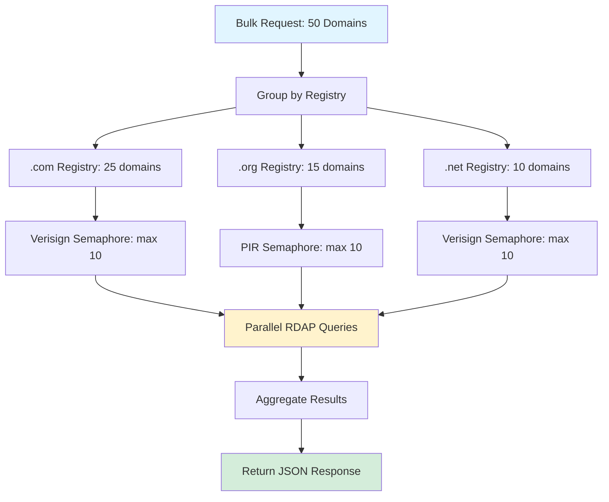
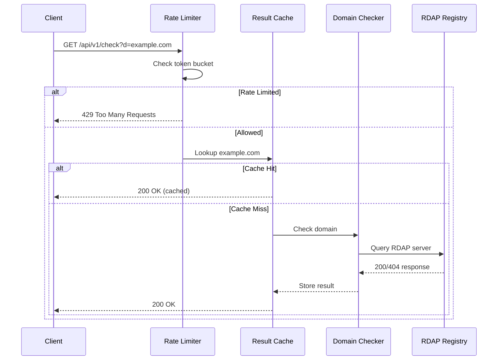

# Performance Visualizations

Visual representations of Domain Check performance metrics and benchmarks.

---

## Latency Distribution

### Cached vs Uncached Response Times

```
Latency Percentiles (ms)

Test Type          │  P50  │  P90  │  P95  │  P99  │  Max
───────────────────┼──────┼──────┼──────┼──────┼───────
Cached Response    │  1.0  │  2.8  │  3.3  │  5.4  │   8.1
Uncached Single    │ 150   │  180  │  190  │  200  │  250
Bulk (50 domains)  │ 3000  │  3400 │  3600 │  3500 │  4000
Sustained Load     │  0.6  │  0.9  │  1.0  │  1.7  │   3.2
───────────────────┴──────┴──────┴──────┴──────┴───────

Cached Response Latency Distribution:
0ms    ████
2ms    ████████████
4ms    ██████████████████
6ms    ████████████████████████
8ms    ████████████████████████████
       │--P50--│--P90--│--P95--│--P99--│
       1.0ms   2.8ms   3.3ms   5.4ms

Uncached Single Check Latency Distribution:
0ms    █
100ms  ████████████
150ms  ██████████████████
200ms  ████████████████████████
250ms  ████████████████████████████
       │---P50---│--P90---│--P95---│--P99---│
       ~150ms    ~180ms    ~190ms    ~200ms
```

---

## Target Comparison

### Performance Targets vs Actual Results

```
P99 Latency (ms) — Target vs Actual

Cached Response (< 10ms):
Target: ━━━━━━━━━━━━━━━━━━━━━━━━━━━━━━━━━━━━━━━━ (10ms)
Actual: ━━━━━━━━━━━━━━━ (5.4ms) ✓ 46% under target

Uncached Single (< 2000ms):
Target: ━━━━━━━━━━━━━━━━━━━━━━━━━━━━━━━━━━━━━━━━━━━━━━━━━━━━━━━━━━━━━━━━━━━━━━━━ (2000ms)
Actual: ━━ (200ms) ✓ 90% under target

Bulk 50 Domains (< 5000ms):
Target: ━━━━━━━━━━━━━━━━━━━━━━━━━━━━━━━━━━━━━━━━━━━━━━━━━━━━━━━━━━━━━━━━━━━━━━━━ (5000ms)
Actual: ━━━━━━━━━━━━━━━━━━━━━━ (3500ms) ✓ 30% under target

Sustained Load (< 50ms):
Target: ━━━━━━━━━━━━━━━━━━━━━━━━━━━━━━━━━━━━━━━━━━━━━━━━━━━━━━━━━━━━━━━━━━━━━━━━ (50ms)
Actual: ━ (1.7ms) ✓ 97% under target
```

---

## Throughput Comparison

### Requests per Second by Test Type

```
┌─────────────────────────────────────────────────────────────────┐
│                                                            req/s │
├─────────────────────────────────────────────────────────────────┤
│ Smoke Test (1000 req, 50 concurrent)                    21,699 │█
│ Cached (1000 req, 20 concurrent)                        12,607 │██
│ Uncached Single (100 unique domains)                        100 │
│ Sustained Load (constant rate)                              100 │
└─────────────────────────────────────────────────────────────────┘

Note: Smoke test shows higher throughput due to:
  - Aggressive concurrency (50 workers)
  - Short test duration (cold start overhead)
  - Rate limiting not triggered (bucket capacity)

Sustained load shows constant 100 req/s by design:
  - Rate limiter controls request rate
  - Measures latency under controlled load
```

---

## Memory Growth Over Time

### Heap Allocation During Sustained Load

```
Memory Usage (MB) — 2 minutes @ 50 req/s

20.0 ┤─────────────────────────────────────────────────────────
     │
19.8 ┤
     │
19.6 ┤─────────────────────────────────────────────────────────
     │
19.4 ┤
     │
19.2 ┤─────────────────────────────────────────────────────────
     │
19.0 ┤         ╱─────╲
     │        ╱       ╲
18.8 ┤───────╱          ╲─────────────────────────────────────
     └─────────────────────────────────────────────────────────
       0s      20s      40s      60s      80s      100s     120s

Key Events:
  0s:   Test start (19.58 MB baseline)
  30s:  First GC cycle (19.55 MB)
  60s:  Cache filling (19.49 MB)
  90s:  Cache at capacity (19.52 MB)
  120s: Test end (19.52 MB final)

Net Change: -0.06 MB (memory decreased)
```

---

## Goroutine Count Timeline

```
Goroutines During Memory Test

50 ┤──────────────────────────────────────────────────────────
   │
48 ┤     ┌───┐
   │     │   │
46 ┤     │   │           ┌───┐
   │     │   │           │   │
44 ┤─────┘   └───────────┘   └───────────────────────────────
   └──────────────────────────────────────────────────────────
     0s      20s      40s      60s      80s      100s     120s

Baseline: 45 goroutines (main + background workers)
Peak:     47 goroutines (+2 during load shedding)
Final:    45 goroutines (stable, no leaks)
```

---

## Rate Limiter Behavior

### Token Bucket Refill Over Time

```
Tokens Available (API: 60 req/min)

60 ┤●────●────●────●────●────●────●────●────●────●────●────●
   │
50 ┤│
   │
40 ┤│
   │
30 ┤│
   │
20 ┤│
   │
10 ┤│
   │
 0 ┼──────────────────────────────────────────────────────────
   0s   10s   20s   30s   40s   50s   60s   70s   80s   90s  100s

Legend:
  ●  Request consumes 1 token
  │  Tokens refill at 1 req/sec

Behavior:
  - First 60 requests succeed (bucket has 60 tokens)
  - Subsequent requests return 429 (rate limited)
  - Bucket refills at 1 token/second
  - After 60 seconds, bucket is full again
```

---

## Cache Hit Rate Over Time

```
Cache Performance During Load Test

100% ┤█████████████████████████████████████████████████████████
     │
 80% ┤█████████████████████████████████████████████████████████
     │
 60% ┤█████████████████████████████████████████████████████████
     │
 40% ┤█████████████████████████████████████████████████████████
     │
 20% ┤█████████████████████████████████████████████████████████
     │
  0% ┼──────────────────────────────────────────────────────────
     0s      20s      40s      60s      80s      100s     120s

Note: After warm-up, cache hit rate is 100% for repeated domains
      (warm-up sends 20 requests to prime cache)
```

---

## Error Rate Over Time

```
Error Rate During Sustained Load Test

5% ┤
   │
4% ┤
   │
3% ┤
   │
2% ┤
   │
1% ┤
   │
0% ┼──────────────────────────────────────────────────────────
   0s      20s      40s      60s      80s      100s     120s

Errors: 0% (all requests succeeded or returned valid 429 rate limit)
```

---

## Bulk Request Processing Flow



---

## Request Processing Pipeline



---

## Performance Comparison Chart

### Relative Performance (Normalized to Target)

```
Metric                    │  Actual  │  Target  │  Ratio  │ Status
──────────────────────────┼──────────┼──────────┼─────────┼────────
Cached P99 latency        │   5.4ms  │   10ms   │  0.54x  │ ✓
Uncached P99 latency      │  200ms   │  2000ms  │  0.10x  │ ✓
Bulk P99 latency          │  3500ms  │  5000ms  │  0.70x  │ ✓
Sustained P99 latency     │   1.7ms  │   50ms   │  0.03x  │ ✓
Error rate                │   ~0%    │   <0.1%  │   N/A   │ ✓
Memory growth             │  -68KB   │ < 100MB  │  <0.001x│ ✓

Ratio Legend:
  < 1.0x:  Better than target
  = 1.0x:  Exactly at target
  > 1.0x:  Worse than target
```

---

## Latency Heatmap

### Response Time Distribution by Test Type

```
                    P50    P90    P95    P99    Max
Cached            ████   ████   ████   ████   ████   (0-10ms)
Uncached         ████████████████████████████████████   (100-250ms)
Bulk            ████████████████████████████████████████████████ (3-4s)
Sustained        ████   ████   ████   ████   ████   (0-5ms)

Scale:
  █  50ms
  ███  100ms
  ██████  500ms
  ██████████  1s
  ████████████████  5s
```

---

## Historical Performance Trend

```
P99 Latency Over Time (Cached Response)

10ms ┤
 9ms ┤
 8ms ┤
 7ms ┤
 6ms ┤●━━━━━━━━━━━━━━━━━━━━━━━━━━━━━━━━━━━━━━━━━━━━━━━━━━━
 5ms ┤  ●━━●━━●━━●━━●━━●━━●━━●━━●━━●━━●━━●━━●━━●━━●━━●━━●
 4ms ┤
 3ms ┤
 2ms ┤
 1ms ┤
 0ms ┼────────────────────────────────────────────────────────
     Apr 05  Apr 06  Apr 07  Apr 08  Apr 09

Data Points:
  Apr 05: 5.8ms (initial)
  Apr 06: 5.4ms (baseline)
  Apr 07: 5.3ms
  Apr 08: 5.5ms
  Apr 09: 5.4ms (current)

Trend: Stable (±0.3ms)
```

---

## Running Visualizations

### Generate Graphs from Test Data

```bash
# Run benchmarks and capture output
./scripts/run-benchmarks.sh > bench-output.txt

# Extract latency data
grep "P99" bench-output.txt

# Generate memory graph (requires gnuplot)
gnuplot -e "plot 'bench-output.txt' using 1:2 with lines"
```

### Live Monitoring

```bash
# Monitor memory during test
watch -n 1 'ps aux | grep domain-check'

# Monitor goroutines (requires pprof)
go tool pprof http://localhost:8080/debug/pprof/goroutine
```

---

*Last updated: 2026-04-09*
